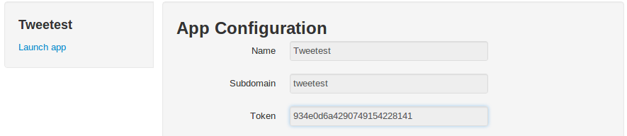

##Innsights API
==============

Overview
----------
Authentication
--------------
You authenticate to the Innsights API by providing a given authenticity token. Each app will be given a different token but each token will remain the same among the distinct app environments.

The authenticity token can be found in the **App Configuration** section.

  
API Services
--------------
* [<code>GET</code> *Timeline*](https://github.com/innku/innsights-docs/master/services/timeline.md)

*  [<code>GET</code> *Group*](https://github.com/innku/innsights-docs/master/services/group.md)

*  [<code>GET</code> *Event*](https://github.com/innku/innsights-docs/master/services/event.md)

*  [<code>GET</code> *Scoreboard*](https://github.com/innku/innsights-docs/master/services/scoreboard.md)
    -  [*Users*](https://github.com/innku/innsights-docs/master/services/scoreboard.md)

    -  [*Resources*](https://github.com/innku/innsights-docs/master/services/scoreboard.md)

Get involved
------------

Please feel free to tell us how we can improve our API. If you have any specific feature request or if you've found a bug, please use **GitHub issues**. Fork these docs and send a pull request with improvements.
